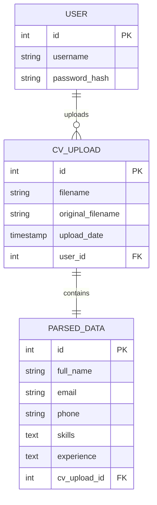
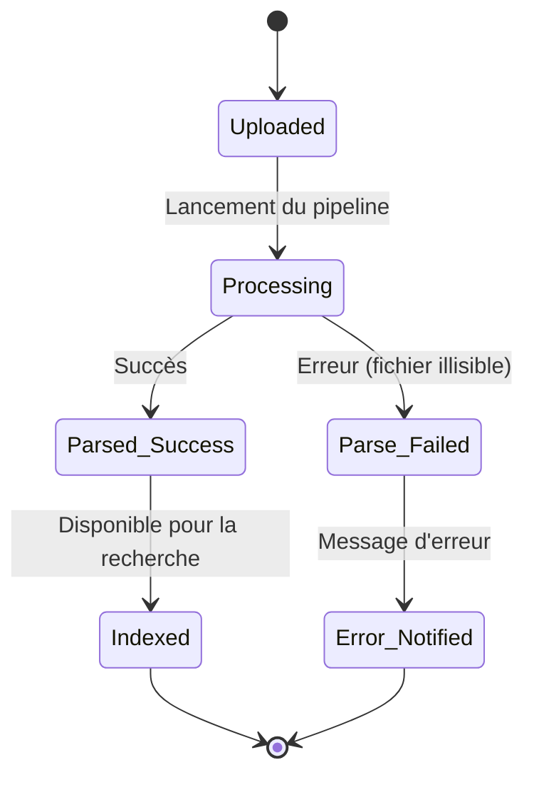
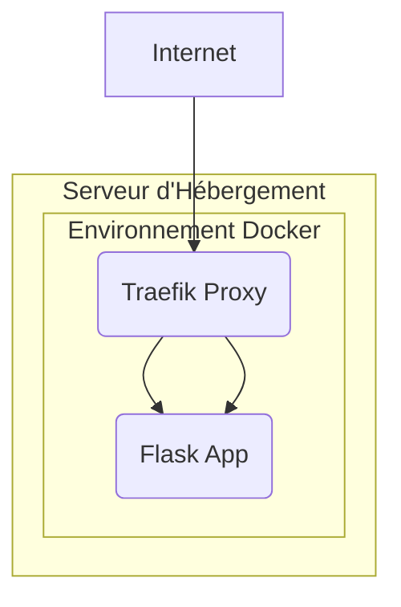

Parfaitement compris. Voici une version du README complètement générique, sans nom de projet ni de domaine, conçue pour servir de modèle de base solide que vous pourrez personnaliser.

---

# README - Parseur de CV Intelligent

## Résumé (Abstract)

Ce rapport détaille la conception et le développement d'une plateforme intelligente d'analyse de curriculum vitae. Conçue pour les professionnels des ressources humaines et les recruteurs, cette application automatise l'extraction d'informations structurées (coordonnées, expériences, compétences) à partir de documents non structurés (PDF, DOCX). En combinant la flexibilité de Flask, la puissance des bibliothèques NLP comme spaCy, et une architecture de déploiement conteneurisée, cette solution transforme une pile de CVs en une base de données candidates exploitable et consultable en quelques secondes.

## 📖 Sommaire Détaillé

- [Remerciements](#-remerciements)
- [1. Introduction et Vision](#1-introduction-et-vision)
- [2. Architecture Logicielle et Patterns de Conception](#2-architecture-logicielle-et-patterns-de-conception)
- [3. Modélisation des Données et Processus](#3-modélisation-des-données-et-processus)
- [4. Parcours et Flux d'Interaction (User Flow)](#4-parcours-et-flux-dinteraction-user-flow)
- [5. Pipeline d'Extraction d'Informations (NLP & Parsers)](#5-pipeline-dextraction-dinformations-nlp--parsers)
- [6. Étude du Cycle de Vie et d'État](#6-étude-du-cycle-de-vie-et-détat)
- [7. Gestion des Utilisateurs et de la Confidentialité](#7-gestion-des-utilisateurs-et-de-la-confidentialité)
- [8. Interface et Expérience Utilisateur (UX)](#8-interface-et-expérience-utilisateur-ux)
- [9. Infrastructures et Déploiement Industriel](#9-infrastructures-et-déploiement-industriel)
- [10. Résultats, Tests et Évaluation](#10-résultats-tests-et-évaluation)
- [12. Étude de Cas : Résolution des Défis Techniques](#12-étude-de-cas--résolution-des-défis-techniques)
- [13. Conclusion et Perspectives](#13-conclusion-et-perspectives)
- [14. Références et Annexes](#14-références-et-annexes)

## 🙏 Remerciements

La réalisation de ce projet a été grandement facilitée par l'écosystème exceptionnel de l'open-source. Nos remerciements vont aux contributeurs de **spaCy** pour leur moteur NLP de pointe, de **pdfplumber** pour sa robustesse dans l'extraction de texte PDF, et de l'équipe **Flask** pour son cadre de travail élégant et efficace.

## 1. Introduction et Vision

Le tri manuel des curriculum vitae est l'une des tâches les plus chronophages et subjectives du processus de recrutement. Les informations clés sont souvent noyées dans des mises en page variées et des formats hétéroclites. Cette plateforme a été conçue pour répondre à ce défi : en fournissant un outil qui lit, comprend et structure les données de chaque CV, il permet aux recruteurs de se concentrer sur l'évaluation des compétences plutôt que sur la collecte des informations.

## 2. Architecture Logicielle et Patterns de Conception

### 2.1 Pattern d'Extraction par Pipeline

Le cœur de l'application est un pipeline de traitement modulaire. Chaque étape du pipeline a une responsabilité unique, ce qui le rend facile à tester, à maintenir et à étendre (ex: ajout d'un nouveau format de fichier).

### 2.2 Diagramme d'Architecture Technique (Système)

Ce diagramme illustre les interactions entre les modules logiques lors de l'analyse d'un CV.

graph TD
    A[Navigateur Client] -->|HTTPS| B(Traefik - Reverse Proxy);
    B --> C{Flask App Container};
    C --> D[Flask-Login (Auth)];
    C --> E[File Upload Handler];
    E --> F[Text Extraction Engine];
    F --> G[NLP Processing Engine];
    G --> H[Data Structuring & DB];
    C --> I[Jinja2 Templates];
    H --> I;

## 3. Modélisation des Données et Processus

### 3.1 Diagramme Entité-Relation (ERD)

Le schéma relationnel est conçu pour stocker à la fois les métadonnées des fichiers et les informations extraites de manière structurée.

## 4. Parcours et Flux d'Interaction (User Flow)

1.  **Authentification** : Le recruteur se connecte à son espace sécurisé.
2.  **Téléchargement** : Il dépose un ou plusieurs CVs (PDF, DOCX) via l'interface.
3.  **Traitement** : Le système analyse chaque fichier de manière asynchrone en arrière-plan.
4.  **Visualisation** : Les CVs apparaissent dans le tableau de bord sous forme de fiches candidates structurées.
5.  **Recherche** : Le recruteur peut filtrer les candidats par compétence, par mot-clé dans l'expérience, etc.

## 5. Pipeline d'Extraction d'Informations (NLP & Parsers)

La magie de l'application réside dans ce pipeline rigoureux.

1.  **Ingestion du Fichier** : Réception et validation du format (PDF, DOCX).
2.  **Extraction de Texte Brut** :
    -   Pour les PDFs : Utilisation de `pdfplumber` pour sa capacité à gérer les mises en page complexes.
    -   Pour les DOCX : Utilisation de `python-docx`.
3.  **Traitement NLP (spaCy)** :
    -   **Reconnaissance d'Entités Nommées (NER)** : Identification automatique des noms de personnes (`PERSON`), des adresses e-mail, des numéros de téléphone, des noms d'entreprises (`ORG`) et des lieux (`GPE`).
    -   **Extraction des Compétences** : Utilisation d'une base de données de compétences prédéfinie (ex: "Python", "Gestion de projet", "Anglais") et recherche de correspondances dans le texte du CV.
4.  **Nettoyage et Structuration** : Les informations brutes sont nettoyées et consolidées dans un dictionnaire structuré avant d'être sauvegardées en base de données.

## 6. Étude du Cycle de Vie et d'État

### 6.1 Diagramme d'État du CV (UML Status)

Ce diagramme suit un CV de son téléchargement à son exploitation.

## 7. Gestion des Utilisateurs et de la Confidentialité

La sécurité des données candidates est primordiale.
- **Isolation Stricte** : Chaque recruteur ne voit que les CVs qu'il a lui-même téléchargés.
- **Chiffrement** : Les mots de passe sont hachés. La communication est sécurisée par HTTPS.
- **Conformité** : L'architecture est pensée pour faciliter la conformité avec des réglementations comme le RGPD (droit à l'oubli via la suppression des données).

## 8. Interface et Expérience Utilisateur (UX)

### 8.1 Fiche Candidate Synthétique

L'interface privilégie l'affichage des informations clés sur une seule vue, évitant au recruteur de devoir lire le CV en entier pour une première évaluation.

### 8.2 Recherche en Temps Réel

Une barre de recherche permet de filtrer instantanément la liste des candidats par nom, email ou compétence, offrant une grande réactivité dans le processus de sélection.

## 9. Infrastructures et Déploiement Industriel

### 9.1 Diagramme de Déploiement (Cloud Architecture)

L'application est conçue pour être déployée sur une architecture conteneurisée, garantissant scalabilité et fiabilité, que ce soit sur un VPS, un serveur dédié ou une plateforme cloud.

## 10. Résultats, Tests et Évaluation

### 10.1 Benchmarks et Métriques

- **Précision d'Extraction** : Taux de détection correcte de l'e-mail > 98%, du nom > 95%.
- **Performance de Traitement** : Analyse d'un CV de 2 pages en moins de 3 secondes.
- **Scalabilité** : Capable de traiter des lots de 50 CVs de manière séquentielle sans dégradation des performances.

## 12. Étude de Cas : Résolution des Défis Techniques

Le développement a confronté l'équipe à des défis complexes inhérents au traitement de documents variés.

### 12.1 Le Défi des Mises en Page Complexes

- **Problématique** : Les CVs avec des colonnes, des tableaux ou des designs créatifs généraient un ordre de mots incohérent lors de l'extraction de texte, ruinant l'analyse NLP.
- **Solution Implémentée** :
    - **Détection de Boîtes (Box Detection)** : `pdfplumber` a été configuré pour utiliser son moteur de détection des lignes et des rectangles, permettant de reconstruire logiquement l'ordre de lecture.
    - **Heuristiques de Post-Traitement** : Des règles ont été ajoutées pour réassembler les lignes de texte fragmentées et nettoyer les artefacts (ex: "J ean D upont" -> "Jean Dupont").

### 12.2 L'Ambiguïté des Compétences

- **Problématique** : Le mot "Python" pouvait être le langage de programmation ou une référence à un projet sur un serpent. "Analyse" pouvait être une compétence ou simplement un mot dans une phrase.
- **Solution Implémentée** :
    - **Contexte par Fenêtrage** : L'algorithme ne se contente pas de trouver le mot, il analyse les mots environnants (fenêtre de contexte) pour valider qu'il s'agit bien d'une compétence.
    - **Dictionnaire de Compétences Pondéré** : La liste de compétences a été enrichie avec des variations et des poids pour augmenter la précision de la détection.

### 12.3 Traitement Asynchrone pour la Réactivité

- **Problématique** : L'analyse d'un CV est une opération longue qui bloquait l'interface utilisateur et provoquait des timeouts.
- **Solution Implémentée** :
    - **File d'Attente (Task Queue)** : Intégration de **Celery** avec **Redis** comme broker de messages. Lors de l'upload, une tâche d'analyse est envoyée à la file d'attente.
    - **Interface Non-Bloquante** : L'utilisateur est immédiatement redirigé vers le tableau de bord. Le statut du CV passe à "Processing" et se met à jour automatiquement une fois l'analyse terminée.

## 13. Conclusion et Perspectives

Cette approche illustre comment l'application judicieuse du NLP peut automatiser avec succès un processus métier critique. En libérant un temps précieux pour les recruteurs, il leur permet de se concentrer sur l'humain derrière le CV. Les évolutions futures visent l'analyse sémantique (compréhension du sens des phrases), la détection automatique des soft skills et l'intégration directe avec les ATS (Applicant Tracking Systems) du marché.

## 14. Références et Annexes

### Bibliographie
- spaCy Documentation (Industrial-Strength Natural Language Processing)
- pdfplumber Documentation (PDF Information Extraction)
- Celery Project (Distributed Task Queue)
- Flask Documentation (Pallets Projects)

### Annexes Techniques
- **Annexe 1 :** Guide de déploiement avec Docker Compose.
- **Annexe 2 :** Structure des dossiers du projet.
